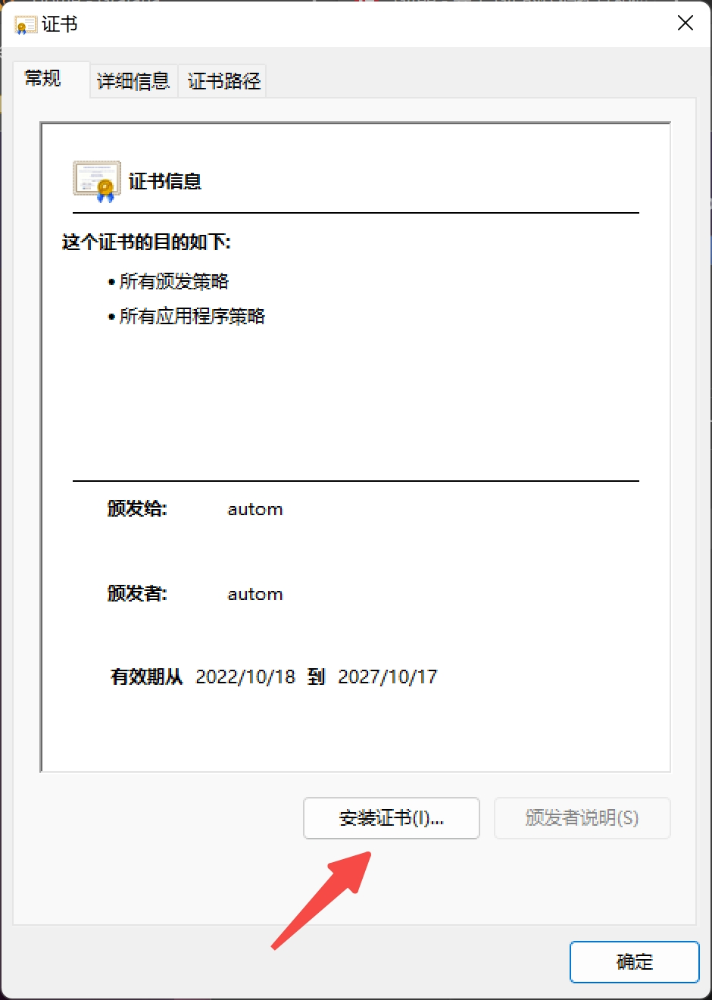
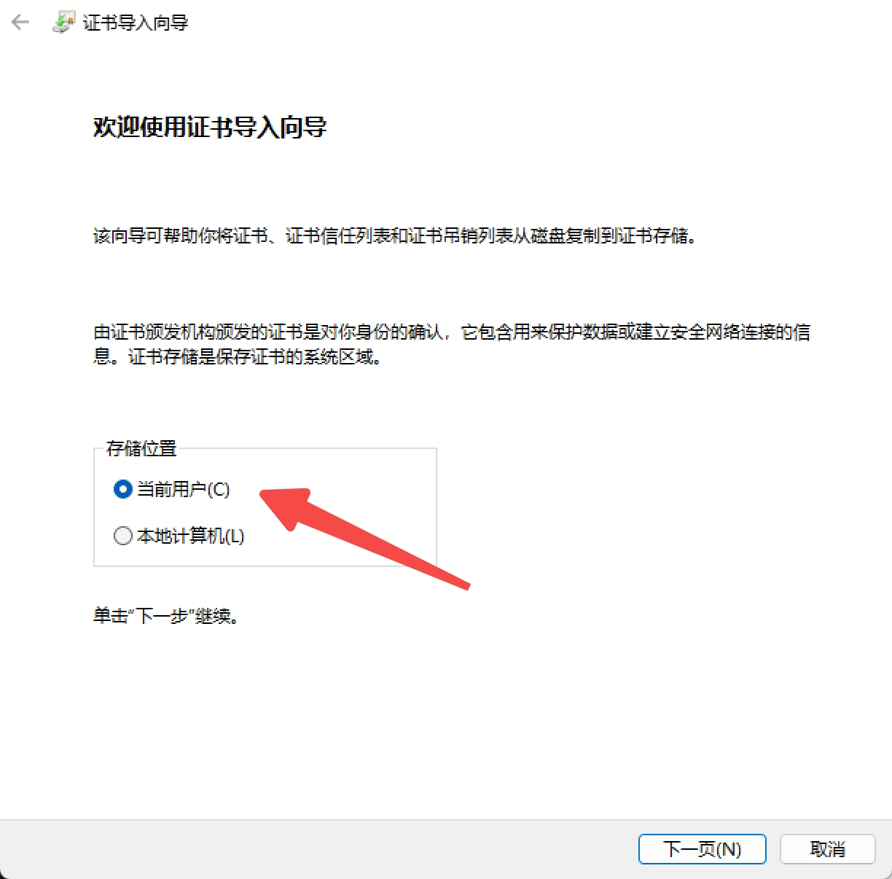
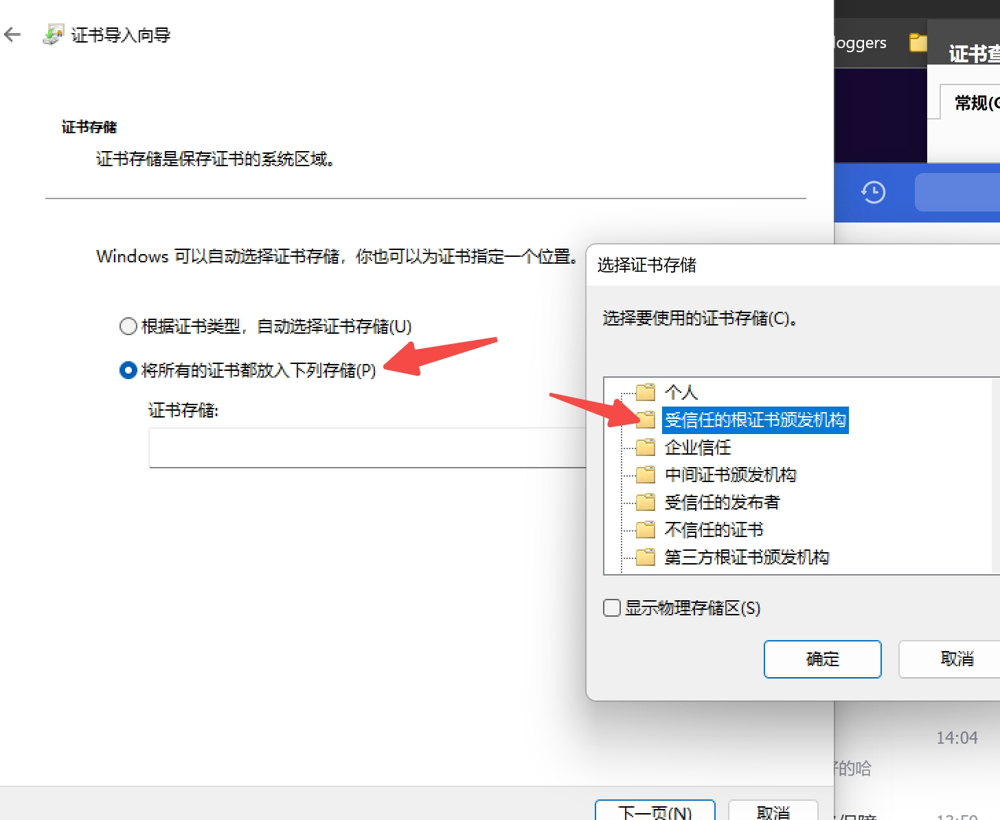
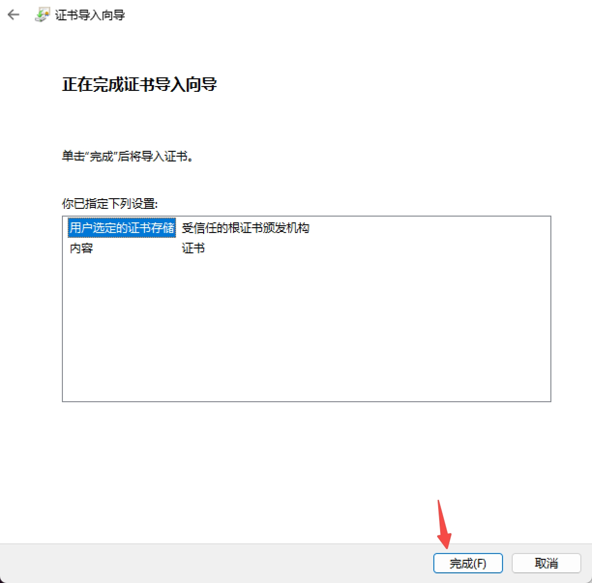

## Using self-signed certificates

### server certs

Configure your servers as usual.

### Trust ca certificate

- Windows






- Ubuntu

```
sudo cp ca/ca.pem /usr/local/share/ca-certificates/gitlifeca.crt
sudo update-ca-certificates
```
